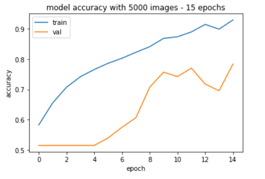
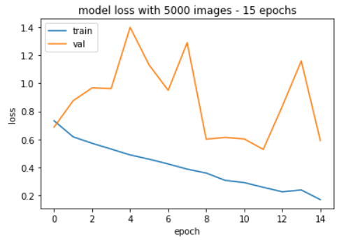
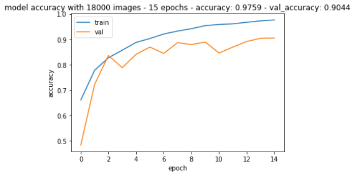
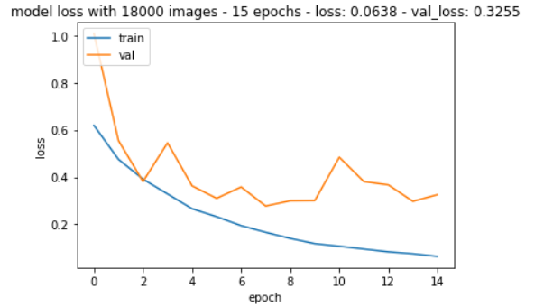
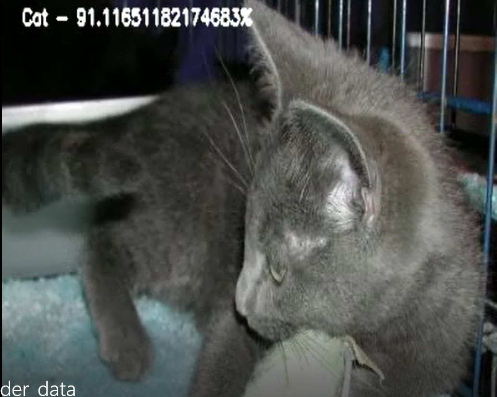
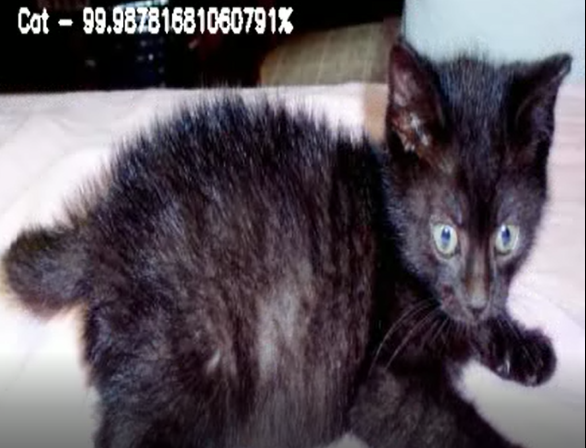
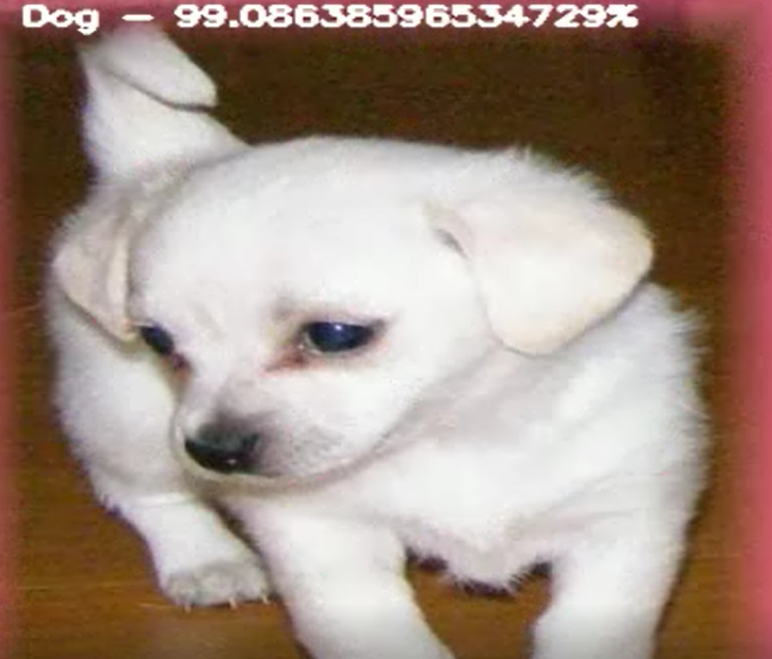
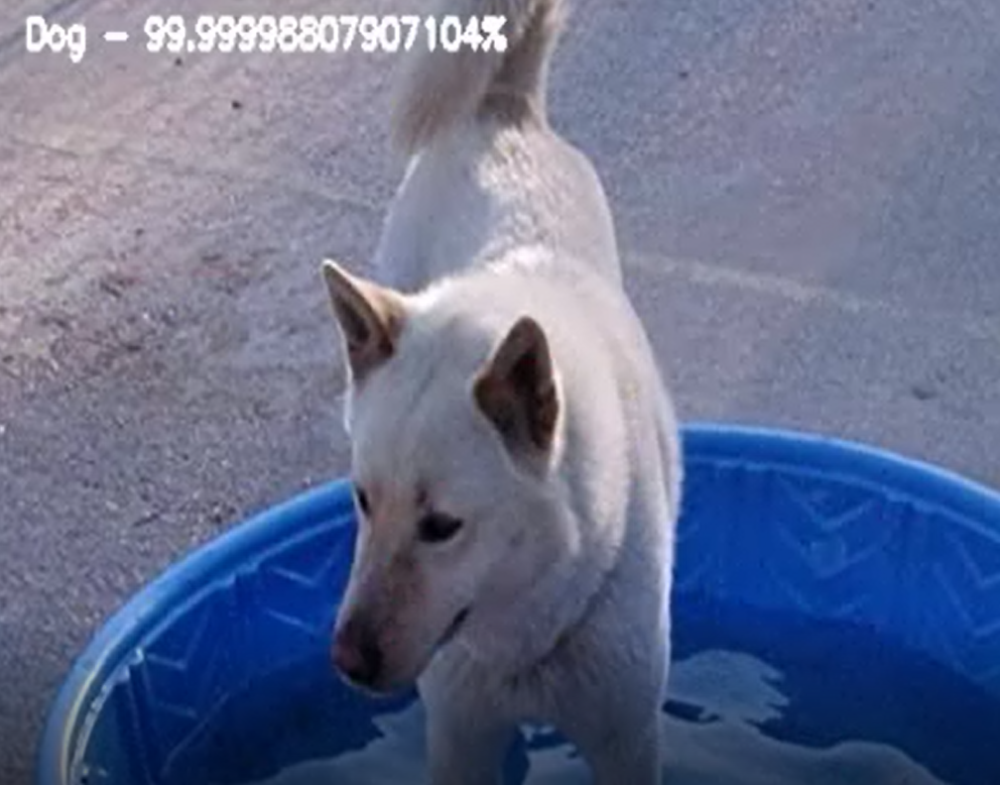

# Image Classification using Convolutional Neural Networks

[](https://colab.research.google.com/github/ozodbek-bosimov/image-classification-using-cnn/blob/main/image_classification_cnn.ipynb)

This project classifies images of cats and dogs using a Convolutional Neural Network (CNN) built with TensorFlow/Keras.

## Project Structure
```
image-classification-using-cnn/
├── Code/
│   ├── constants.py              # Configuration constants
│   ├── data_prep.py              # Data loading and preprocessing
│   ├── model.py                  # CNN architecture
│   └── main.py                   # Training pipeline (local)
├── image_classification_cnn.ipynb  # 🔥 Google Colab notebook
├── output/                       # Training results and predictions
├── requirements.txt              # Python dependencies
├── Report.pdf                    # Detailed project report
└── README.md
```

## Quick Start (Google Colab) — Tavsiya qilinadi

1. Yuqoridagi **"Open in Colab"** badge'ni bosing
2. `REPO_URL` ni o'z GitHub repo URL'ingizga o'zgartiring
3. Runtime → Change runtime type → **GPU (T4)** tanlang
4. Har bir cell'ni ketma-ket ishga tushiring

## Results

- Training data: 18,000 images (cats + dogs)
- Epochs: 15
- Train/Validation split: 80/20

### Model Architecture
```
CONV 3x3 layers with batch norm: 32 → 64 → 96 → 96 → 64
Dense layers with dropout: 256 → 128 → 2 (softmax)
Loss: categorical_crossentropy
Optimizer: Adam
```

### Performance
| Metric | Score |
|---|---|
| Training Accuracy | 97.59% |
| Validation Accuracy | 90.44% |
| Training Loss | 0.0638 |
| Validation Loss | 0.3255 |

### Training Plots






### Prediction Samples






## Local Setup (Alternative)

```bash
git clone https://github.com/ozodbek-bosimov/image-classification-using-cnn.git
cd image-classification-using-cnn
pip install -r requirements.txt
# Download the dataset and place train/ and test1/ folders in project root
cd Code/
python main.py
```

## Dataset

[Kaggle Dogs vs. Cats](https://www.kaggle.com/c/dogs-vs-cats/data) — Download and extract `train/` and `test1/` folders into the project root directory.
