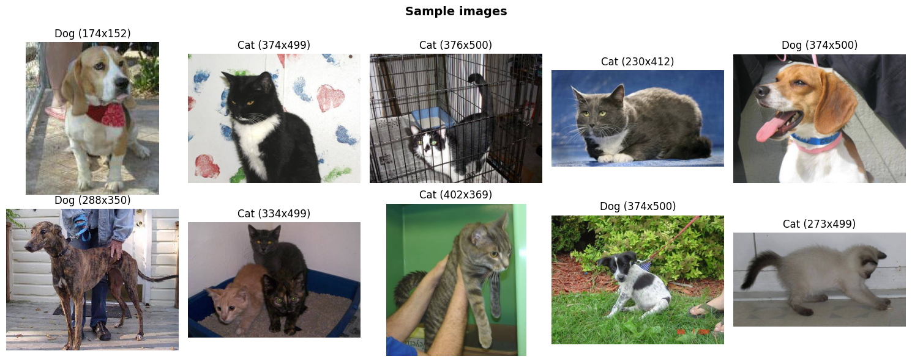
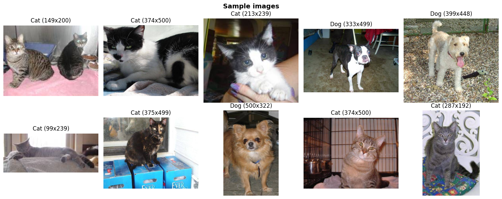
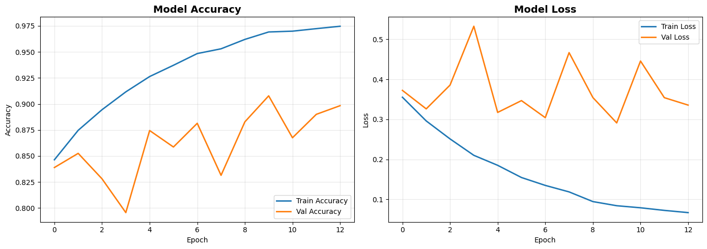
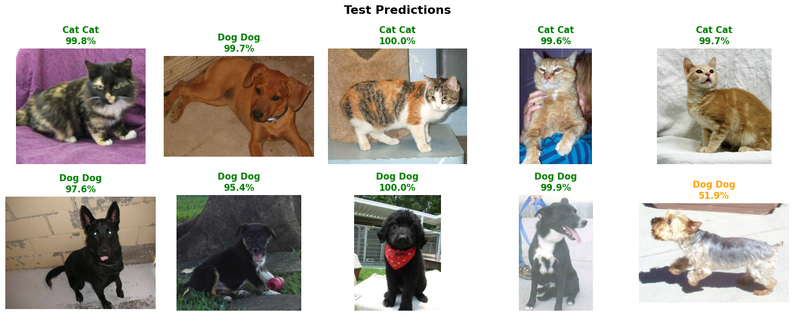
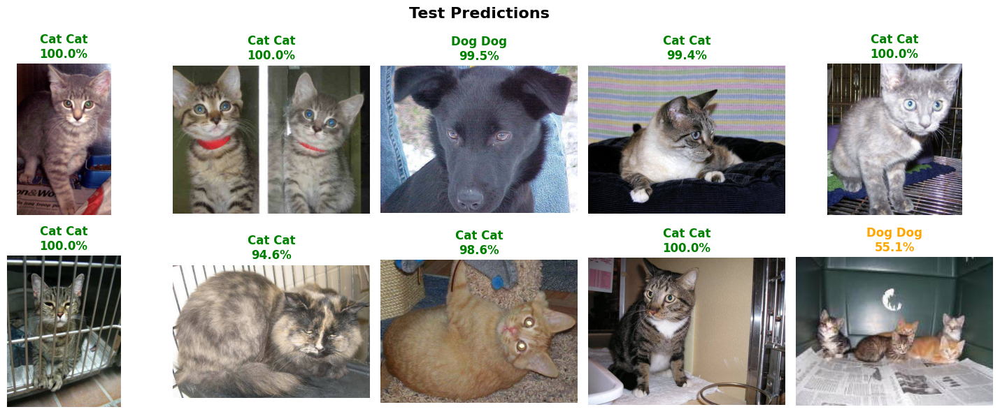
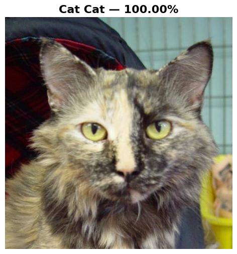
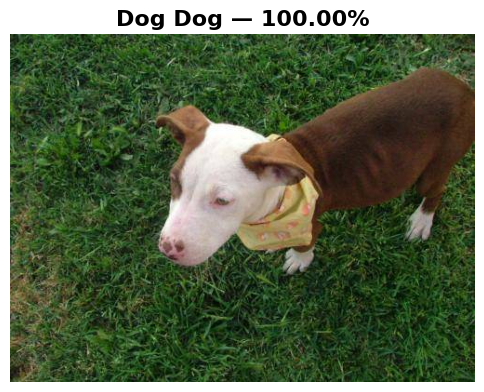

# Image Classification using Convolutional Neural Networks

[](https://colab.research.google.com/github/ozodbek-bosimov/image-classification-using-cnn/blob/main/image_classification_cnn.ipynb)

A deep learning project that classifies images of **cats and dogs** using a Convolutional Neural Network (CNN) built with TensorFlow/Keras. The model achieves **97.5% training accuracy** and **89.8% validation accuracy** on the Kaggle Dogs vs. Cats dataset.

## Project Structure

```
image-classification-using-cnn/
├── Code/
│   ├── constants.py                # Configuration and hyperparameters
│   ├── data_prep.py                # Data loading and preprocessing
│   ├── model.py                    # CNN model architecture
│   └── main.py                     # Local training pipeline
├── image_classification_cnn.ipynb  # Google Colab notebook (recommended)
├── output/                         # Training results and prediction samples
├── requirements.txt
└── README.md
```

## Quick Start (Google Colab)

1. Click the **"Open in Colab"** badge above
2. Go to **Runtime → Change runtime type → GPU (T4)**
3. Run each cell sequentially — the dataset downloads automatically

## Dataset

[Kaggle Dogs vs. Cats](https://www.kaggle.com/c/dogs-vs-cats/data) — 25,000 labeled images of cats and dogs.

- **Training set:** 18,000 images (randomly sampled)
- **Train/Validation split:** 80/20
- **Image size:** Resized to 110×110 pixels

### Sample Images

| | |
|---|---|
|  |  |

## Model Architecture

```
Input (110×110×3)
  → Conv2D(32, 3×3, ReLU) → MaxPool(2×2) → BatchNorm
  → Conv2D(64, 3×3, ReLU) → MaxPool(2×2) → BatchNorm
  → Conv2D(96, 3×3, ReLU) → MaxPool(2×2) → BatchNorm
  → Conv2D(96, 3×3, ReLU) → MaxPool(2×2) → BatchNorm → Dropout(0.2)
  → Conv2D(64, 3×3, ReLU) → MaxPool(2×2) → BatchNorm → Dropout(0.2)
  → Flatten
  → Dense(256, ReLU) → Dropout(0.2)
  → Dense(128, ReLU) → Dropout(0.3)
  → Dense(2, Softmax)

Loss: categorical_crossentropy | Optimizer: Adam
```

## Results

Trained for **15 epochs** (EarlyStopping with patience=3).

| Metric | Score |
|---|---|
| Training Accuracy | 97.47% |
| Validation Accuracy | 89.83% |
| Training Loss | 0.0671 |
| Validation Loss | 0.3357 |

### Accuracy and Loss



### Test Predictions

| | |
|---|---|
|  |  |

### Custom Image Predictions

| | |
|---|---|
|  |  |

## Local Setup

```bash
git clone https://github.com/ozodbek-bosimov/image-classification-using-cnn.git
cd image-classification-using-cnn
pip install -r requirements.txt
```

Download the [Kaggle Dogs vs. Cats](https://www.kaggle.com/c/dogs-vs-cats/data) dataset and extract `train/` and `test1/` folders into the project root, then:

```bash
cd Code/
python main.py
```

## Technologies

- Python 3.10+
- TensorFlow / Keras
- OpenCV
- NumPy
- Matplotlib
- Google Colab (GPU: NVIDIA T4)
